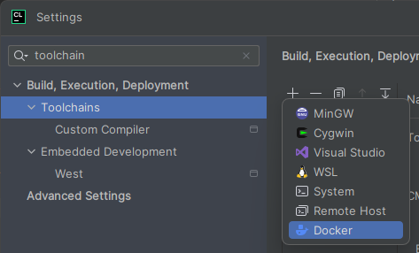
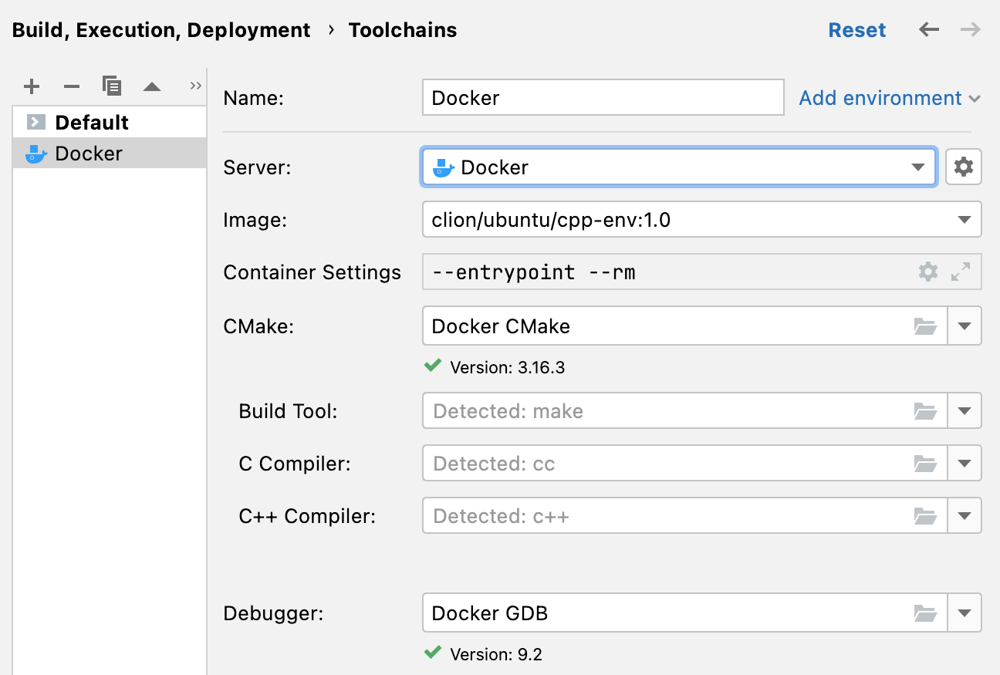

# Container environment setup

## Overview

This guide will demonstrate how to set up the tools and development environment we will use for the remaining projects in this course. We will provide our environment using a **container**, a technology that provides an abstraction of a separate OS without the full overhead of a Virtual Machine (VM). This container runs a Linux-based operating system, **Ubuntu 22.04**. In addition, we will set up some additional tools to allow you to run Wireshark, an industry-standard packet capture tool, from inside your container. Wireshark is useful as a debugging tool, and a great way to learn about networks.

When we grade your work, we will use the same container environment–so if your program works in your container, it should work in our grading environment.  This is also the same environment used for the GitHub autograder.

### Why are we using these tools?

* **You’ll be able to develop locally.** With the container environment, we can specify a standard development environment you can run on your own machine, so your code can work on any system. Thus, you don’t need to log into the department machines to write/test your code!

* **Wireshark is awesome.** Wireshark is a powerful debugging tool for building network programs: as you send packets over the network, you can view their contents and determine if they are formatted properly. You can also perform a number of analyses over different types of network connections (like TCP), which we will see later in the course.


## Environment setup

To run our environment, there are two components you need to configure on your host computer: **Docker**, the program that builds and runs the container, and an **X11 server**, which is responsible for displaying Wireshark’s window on your system.

Some of the configuration steps here differ based on your **host platform**, i.e. the system you are using to run the container, which is probably Windows, Mac OS, or Linux. Please make sure you follow the correct set of instructions for your platform.

### Configure docker

[Docker](https://docker.com) is one of the most popular container solutions and widely used in industry.  To install Docker.

1. Download and install Docker Desktop, located [here](https://www.docker.com/products/docker-desktop). On Linux machines, follow the instructions [here](https://docs.docker.com/engine/install/ubuntu/).

    > ### Already have docker installed?
    > If you already have Docker installed, **we strongly recommend updating to the latest version** by reinstalling it from Docker's website.
    > 
    > Many odd quirks and bugs can result from using old versions of Docker, so updating now is the best way to avoid quirks or other issues from coming up later in the semester!  
   
    > ### Mac users
    > **We do NOT recommend installing Docker with homebrew.**  This may not install the latest version of all of docker's components, and so is likely to have issues.  Please install the version from Docker's website instead.

2. On Windows or macOS, open the Docker Desktop application after it has been installed. You may see a message similar to “Your Docker is starting...”. Once this message goes away, your Docker has started successfully!

    Click for extra instructions for Windows-based systems


3. Verify Docker is installed by executing the following:
    ```shell
    $ docker --version
    ```
    
    Once you execute the above command, you should see the Docker version number, for example:
    
    ```shell
    $ docker --version
    Docker version 20.10.12, build e91ed57
    ```

4. After installing Docker, a Docker process (the Docker daemon) will run in the background. Run the following command to verify:
    ```shell
    $ docker info
    ```
    
    If you see the following error:
    ```
    ERROR: Cannot connect to the Docker daemon at unix:///var/run/docker.sock. Is the docker daemon running?
    ```
    it means Docker hasn’t started running yet. On Windows or macOS, ensure your Docker Desktop is running. On Linux, try the command `sudo systemctl docker restart` in a terminal.

    > ### Important extra instructions for mac users
    > We have noticed that some MacOS users may experience filesystem issues with default settings:  **[follow these instructions to check your Docker installation](#Filesystem-Performance-on-Macs)**.
    >
    > **Do not skip this step or you may encounter problems later!**


### X Server

The next component we need is an X11 server. X11, or [X Window System](https://en.wikipedia.org/wiki/X_Window_System) is the framework that powers most GUI applications in Linux. Wireshark is a GUI application, so when we run it in the container, it needs to connect to a program on the host (the X server) that can draw its window.

The X server we will install differs based on your host operating system. Select the set of instructions for your platform:

#### Instructions for Windows

1. Download and install [VcXsrv](https://sourceforge.net/projects/vcxsrv/), which is an X11 server built for Windows. Run the installer (default options should be fine), and allow the app to make changes to your computer when prompted.
2. Once VcXsrv is installed, run it from the start menu. If it asks you some questions, you can just accept the defaults and click "Next" until it goes away.
3. Once VcXsrv has finished starting, you should see it running in your system tray (bottom right corner of your screen), indicating you are ready to continue.

**Note**: Each time you restart your computer, you will need to start VcXsrv whenever you need to run the container.


#### Instructions for Mac OS

1. Download and install [XQuartz](https://www.xquartz.org/), which is an X11 server built for Mac OS.  Run the installer, and allow the app to make changes to your computer when prompted. During installation, you will be asked log out and log back into your computer, in order to update your system environment.
2. Once XQuartz is installed, open it from the applications menu. Once it opens, go to the menu bar at the top of your screen and select **XQuartz > Preferences**. Go to the **Security** tab and check the box labeled "**Allow connections from network clients**" (like the figure below). This will allow the container to connect to your X server.
   

3. Quit XQuartz by selecting **XQuartz** > **Quit** from the menu bar. XQuartz should re-open automatically when you start the container later.

The X server itself provides its own authentication mechanism to prevent outside hosts from connecting. When we run the container, we tell the X server to allow connections from the virtual network that Docker creates on your computer--this network is only accessible within your own system, so outside users cannot connect to it.

If you are still concerned, however, you can turn on the [Mac OS firewall](https://support.apple.com/en-us/HT201642), which will prevent outside connections to the X11 port at the network level.

#### Instructions for Linux
If you use Linux, you most likely already have an X server installed, so you have little work to do here! There is one other small utility we need, `xhost`, a tool to control who can access the X server.

Check if you have `xhost` by entering the following command:
```shell
$ which xhost
```

If the result is `xhost not found`, you will need to install this on your system. On Ubuntu or Debian, you can do this using the command `sudo apt-get install x11-xserver-utils`. On other distributions, you will need to install a similar package (though the name may be different).

Once you have installed `xhost`, you should get a result like the following:
```shell
$ which xhost
/usr/bin/xhost
```

## Set up the container environment

In Docker, an environment is defined as a __Docker image__. An image specifies the OS environment that a container provides, as well as other software dependencies and configurations. The instructions defining an image are specified in a file called the __Dockerfile__.

Next, you will download the course's setup code and create the CS 441 Docker image.

### Initial instructions for Mac OS users

If you’re running on macOS, you will need to install a set of Apple-recommended command-line tools via the following command:
```shell
xcode-select --install
```
This ensures that your computer has installed `git`, a program we’ll use below. Alternatively, you may also download and install `git` directly, following instructions <a href="https://git-scm.com/download/mac" target="_blank" rel="noopener"><span>here</span></a><span>.</span> After that, continue with the rest of these instructions.</p>


To set up your environment, do the following:

1. Open a terminal to the directory where you want to do your coursework.  Windows users should open a WSL terminal, then read the note below.

    > ### Important note for Windows Users
    > Check your terminal's working directory before continuing.  If it starts with `/mnt/c/` (or another drive letter), you should switch to a directory *within* your WSL system (e.g., a folder in your WSL home dir, like `~/cs441`) before continuing.  For example:
    >
    > 
    >
    > Using your container environment from `/mnt/c` has been known to cause performance problems, which you can easily avoid by changing directories.
    >
    > **For more details on what this means**, and how to generally work with WSL and Docker, please read [this section](#Windows-using-the-container-with-WSL) for a tutorial.  
   
2. Enter the following command to download our development environment to the new subdirectory `<DEV-ENVIRONMENT>` (you can choose your own name, without the brackets, `<DEV-ENVIRONMENT>` is a placeholder):
    ```shell
    $ git clone https://github.com/CSUEB-CS441/container-env.git DEV-ENVIRONMENT
    ```
3. Run `cd <DEV-ENVIRONMENT>` to enter the directory you just created
4. Inside this directory, do the following:
    ```shell
    $ ./run-container setup  # Loads our course docker image
    ```

    `./run-container setup` downloads your Docker image, which may take a few minutes--so feel free to take a break!

> ### Read this if you get errors about permissions on docker.sock
> When docker installs itself, it normally sets up your user with permissions to control docker (via a socket file called `docker.sock`).  If you don't have permissions on this socket, you might need to close and reopen your terminal app, or log out and log in again, before the permissions changes take effect.
>
> **If you are on Linux**:  you may also need to add your user to the `docker` group manually, as follows:
> 1. Open a terminal and run:
> ```
> $ sudo usermod -a -G docker YOUR_USERNAME
> ```
> 2. Log out and log back in for the changes to take effect.
>
> **We do NOT recommend running `./run-container` with `sudo`**.  This *will* start the container, but it could cause other permissions problems later because the script is no longer running as your user.``

> ### Extra instructions for Windows users
> We have noticed that Docker might use a lot of memory on Windows due to some open bugs with Docker and WSL (the windows component that provides Linux).
>
> If you notice that other programs slowing down or crashing, or otherwise notice docker using lots of memory, see [these instructions](#Windows-performance-and-stability-issues) for how to check Docker's memory usage and keep it under control.

### Why are there two Dockerfiles?

You may notice that there are two Dockerfiles in the docker folder: Dockerfile and Dockerfile.arm64. Why are there two Dockerfiles, when CS 441 only uses one container?

Machines run on different architectures, and we will explore that in our course during the semester. Computers that use an Intel chip runs on Intel’s x86 architecture. Recent Macs released by Apple begin to use Apple silicon, which run on the ARM architecture.

Different architectures use different sets of CPU instructions. Therefore, programs running on different architectures need to be compiled differently.

Students running on ARM machines use Dockerfile.arm64, which installs additional packages to compile x86 binaries on an ARM machine. Other students, running on chips that use the x86 architecture, use Dockerfile.

## Entering the container

Once you created your Docker image, we need to create a container running the image. In Docker terms, a _container_ is an _instance_ of an image, which is where you will actually do your work. Docker (and other container frameworks) are designed to easily start up and tear down individual containers based on a single image.

You can enter your container as follows:

1. Make sure you're inside the directory `<DEV-ENVIRONMENT>`, which is the top-level directory of the repository earlier.
2. Run the script `run-container` to start the container, and poke around to get a sense of the environment:  (__Windows users__:  If you get errors, see [this section](#Windows-line-endings-%E2%80%9Cunexpected-end-of-file%E2%80%9D) for help.)

```shell
$ ./run-container              # enters your Docker container
cs441-user@9899143429a2:~$    # you're inside the container!
cs441-user@9899143429a2:~$ uname
Linux
cs441-user@9899143429a2:~$ echo "Hello world!"
Hello world!
cs441-user@9899143429a2:~$ ls -lah
total 24K
drwxr-xr-x 6 cs441-user cs441-user  192 Jan 25 22:23 .
drwxr-xr-x 1 root       root         4.0K Jan 25 22:25 ..
-rw-r--r-- 1 cs441-user cs441-user  132 Jan 25 22:23 .bash_profile
-rw-r--r-- 1 cs441-user cs441-user 4.0K Jan 25 22:23 .bashrc
-rw-r--r-- 1 cs441-user cs441-user   25 Jan 25 22:23 .gdbinit
-rw-r--r-- 1 cs441-user cs441-user  813 Jan 25 22:23 .profile
cs441-user@9899143429a2:~$ exit  # or Ctrl-D
```

Don’t worry if the number after cs441-user is different. This is an identifier that uniquely identifies this container.

You may run any Linux commands inside this container, such as running your code for this course. To exit, enter `exit` or use Ctrl-D.

### Resuming your work / Multiple shells

Once you have exited the container, you can open it again by running `./run-container` again from the `<DEV-ENVIRONMENT>` directory. This will restart your current container if it exited in the same state it was in before.

If you want to open another shell in the same container, simply open a new terminal window on your computer, navigate to the `<DEV-ENVIRONMENT>` directory and run `run-container`--the script will automatically detect that the container is already running and "attach" itself to the current container.

## Working in the container environment

### Shared folders

*“If my docker container is a separate (virtual) computer than my laptop, how will I move files between the two?”*, you may ask. Great question!

Inside of the container, your home directory (`/home/cs441-user`, or `~`) is actually a mount of the home directory inside your `<DEV-ENVIRONMENT>` directory. Any changes you make in one will be visible in the other.

At this stage, you should test this out to make sure it works (and to make sure you understand what's happening).

1. Outside the container, go to the directory `<DEV-ENVIRONMENT>/home` and create a file and a directory.
2. Inside the container, you should see the file and folder you created inside your home directory. Delete the file, and add a file to folder (again, this is just a test to see what's happening).
3. Look at the `<DEV-ENVIRONMENT>/home` directory outside the container--you should see the changes you made in this directory.

### Help

1. Outside of the container, in your `<DEV-ENVIRONMENT>/home` folder:
```shell
$ touch cool_file
$ mkdir awesome_folder
$ cd ..
$ ./run-container
```
2. Inside the container:
```shell
cs441-user@9899143429a2:~$ ls # Show the file and dir we just created
awesome_folder    cool_file
cs441-user@9899143429a2:~$ rm cool_file
cs441-user@9899143429a2:~$ cd awesome_folder
cs441-user@9899143429a2:~$ touch even_cooler_file
cs441-user@9899143429a2:~$ exit # or just CTRL-D
```
3. Back outside the container:
```shell
$ cd home            # this enters the mounted directory
$ ls                 # should just show awesome_folder
awesome_folder
$ cd awesome_folder
$ ls                 # should show even_cooler_file
even_cooler_file
```

#### Using shared folders
As you work on your code, you can take advantage of shared folders, for example:
- You could clone your repository and use git outside the container,
  rather than setting up SSH keys inside the container
- You can edit your code outside the container using your favorite
  graphical editor (VSCode, CLion, ...)  and the compile/run your
  work inside the container

> ### Warning for Mac Users
> Files not updating in the container?
>
>If you have issues with changes in shared files not updating inside the container, you may need to check your container file sharing settings.  Docker has several methods for sharing files on MacOS--we recommend the **VirtioFS** method, which seems to be the most stable.   To set it up, see [here](#Filesystem-Performance-on-Macs)
>
> If this doesn't solve the problem, you can try this [legacy version](#Legacy-MacOS-file-sharing-method) instead.
>
> If issues persist, please post on class Discord.

#### Note: if you move or rename your `<DEV-ENVIRONMENT>` directory...

Your Docker container will still try to mount to the original dev-environment path, even after you rename, remove, or move the folder `DEV-ENVIRONMENT`.

After moving your dev-environment folder, you’ll need to delete the old container and start a new container. You can do so with:

```shell
./run-container --clean
```

You should be able to enter a container, and see all of your work now!

### Modifying the container

Once you have a shell inside the container, you can run any Linux command as you would on any other Linux system. Feel free to play around, install packages, etc. The user `cs441-user` has passwordless `sudo` access inside the container, so to install a package you can simply run (eg. for `vim`):
```shell
sudo apt-get install vim
```
We have pre-installed compilers for the languages you are likely to use in this class. As you work on your projects, please use the versions of the compilers installed here so ensure that we can replicate your work when grading. If you have questions about the environment and our grading procedures, please feel free to check with us.

### Rebuilding the container environment (don't do this now, but remember for later)

If you want to start a fresh container, close any container shells you have open (eg. with `exit`), go to the `<DEV-ENVIRONMENT>` directory and run `./run-container --clean`.

Running `./run-container --clean` will remove any custom packages, that you have installed and make a fresh container from the base image. This is because `--clean` removes any existing cs441 containers on your system.

If you have custom configurations for your packages, (e.g., a `.vimrc` file for vim), the configurations are persisted even if you have used `--clean`. This is because user-specific configurations are stored in `~` (or its sub-directories), which are located in the `<DEV-ENVIRONMENT>/home` directory on your machine.

## Connecting CLion to the container (highly recommended)

We recommend using CLion to work on the projects--CLion natively allow you to easily connect it to a running Docker container and run your code inside it. This means you will be able to view and edit files that are in your container's home directory from within a CLion, and use CLion to debug your programs, which will be very helpful in upcoming projects.

If you don't want to use CLion, skip to [Running Wireshark](#Running-Wireshark).
1. After you have installed and opened CLion, go to settings and search for **toolchain**. Click the `+` and add Docker.





2. If you have not done so already, switch to a terminal and start your container by running `./run-container`.  For instructions on how to do this, see [here](#Entering-the-container).

3. Now that the container is running, we can tell VSCode to connect to it. To do this, switch to VS Code and click on the the small button in the very bottom left of the window (when you hover over the button, it should say **"Open a Remote Window"**)--you'll see a window like the one in the image below. Click on the option that says **"Attach to Running Container..."**.


4. Select the container you wish to use, i.e. `cs441-container`:


**Don't see the container?**  Remember that the container needs to be running for it to show up. This means you should have a terminal open inside your container (usually outside of VS Code). For instructions on starting your container, see [here](#Entering-the-container).


5. Once you select the container you want, VS Code should open a new window that looks the same as your normal window, except this one is connected to the container you chose in the previous step. You can confirm this by looking at the bottom left of the new window: it should show the name of the container, like in the image below:


6. In this new window, click on the **"Open Folder"** option--you should be able to poke around the container's filesystem and open files, just like on your host system!  For example, you can look inside your home directory by typing in `/home/cs441-user`, which goes to your home directory inside the container (like you were exploring earlier, [like you saw in the terminal](#Shared-folders)).  As you get set up for Snowcast, we'll provide info on how to clone your git repository to open it here.


### Navigating files in VSCode (read now, remember for later)

Once you start opening files/folders to work on code, VSCode may prompt you to install tools/plugins to work with different languages. This will occur even if you have these plugins set up on your host system--the instance of VS Code in the container is separate from the host version, so it needs to set up everything again.  At first, VS Code might need to install a lot of components, so the installation could take a while. After it finishes, everything should work like a normal VS Code instance!

## Connecting VS Code to the container (highly recommended)

We recommend using VSCode to work on the projects--VS Code has some *excellent* extensions that allow you to easily connect it to a running Docker container and run your code inside it. This means you will be able to view and edit files that are in your container's home directory from within a VS Code window, and use VSCode's debugger to debug your programs, which will be very helpful in upcoming projects.

If you don't want to use VSCode, skip to [Running Wireshark](#Running-Wireshark).

To install and set up VSCode:

1. First, download and install [VS Code](https://code.visualstudio.com/) if you don't already have it.

2. After you have installed and opened VS Code, navigate to the extensions menu (on the left panel of VS Code), and search for the **"Dev Containers"** extension by Microsoft. Click **"Install"** to install the extension.


3. If you have not done so already, switch to a terminal and start your container by running `./run-container`.  For instructions on how to do this, see [here](#Entering-the-container).

3. Now that the container is running, we can tell VSCode to connect to it. To do this, switch to VS Code and click on the the small button in the very bottom left of the window (when you hover over the button, it should say **"Open a Remote Window"**)--you'll see a window like the one in the image below. Click on the option that says **"Attach to Running Container..."**.


4. Select the container you wish to use, i.e. `cs441-container`:


**Don't see the container?**  Remember that the container needs to be running for it to show up. This means you should have a terminal open inside your container (usually outside of VS Code). For instructions on starting your container, see [here](#Entering-the-container).


5. Once you select the container you want, VS Code should open a new window that looks the same as your normal window, except this one is connected to the container you chose in the previous step. You can confirm this by looking at the bottom left of the new window: it should show the name of the container, like in the image below:


6. In this new window, click on the **"Open Folder"** option--you should be able to poke around the container's filesystem and open files, just like on your host system!  For example, you can look inside your home directory by typing in `/home/cs441-user`, which goes to your home directory inside the container (like you were exploring earlier, [like you saw in the terminal](#Shared-folders)).  As you get set up for Snowcast, we'll provide info on how to clone your git repository to open it here.


### Navigating files in VSCode (read now, remember for later)

Once you start opening files/folders to work on code, VSCode may prompt you to install tools/plugins to work with different languages. This will occur even if you have these plugins set up on your host system--the instance of VS Code in the container is separate from the host version, so it needs to set up everything again.  At first, VS Code might need to install a lot of components, so the installation could take a while. After it finishes, everything should work like a normal VS Code instance!


## Running Wireshark

One of the most important features of our container environment is that you can run Wireshark to view and debug your network traffic.

Wireshark is a graphical application. In general, running graphical programs inside a container can sometimes be buggy, so we support two ways to run Wireshark: a *primary method*, and a *backup method*.

The primary method requires an X11 server on your host system (which you should have just installed), and provides the most seamless way to run graphical apps from the container. __If you encounter issues with the primary method, just use the backup method.__ The backup method creates a virtual desktop that displays Wireshark inside a browser--this does not require any special applications on your host system, but is a bit slower.


### Primary method

To run Wireshark, open a terminal to your container and run the following:
```shell
$ wireshark
```

If everything worked, Wireshark should open in a new window that looks like the picture below--you might see some errors print in the terminal as Wireshark starts up, but these are safe to ignore as long as Wireshark opens.  Now you can use Wireshark, yay!  :tada:


**If this doesn't work**, try the [backup method](#Backup-method). Also feel free to post about your experience on EdStem and we will do our best to help, or come see Nick during office hours.

:::success
**What to expect**:  When you run wireshark like this, it will stay running in your terminal until you close the application or press `Ctrl+C` in the terminal where you ran it. You might see some errors printed in the terminal as wireshark starts up--these are fine to ignore so long as Wireshark opens.

In the meantime, you can open another terminal to your your container by simply running `./run-container` from another terminal window.
:::

:::info
**Tip: Running wireshark in the background**:  To avoid keeping a terminal open just for Wireshark, you can run it as a *background process* which redirects all of Wireshark's output to `/dev/null` so it doesn't clutter your terminal:
```shell
$ wireshark > /dev/null 2>&1 &  # Redirect stdout/stderr to /dev/null
```
:::
If Wireshark is crashing for some reason, go back to the previous method and run Wireshark as a foreground process so that you can see the output.  If you have issues with Wireshark and ask us for help, we may ask you for this information.

### Backup method
<details><summary><b><u>Click to expand if you need it</u></b></summary>

Our backup method to run Wireshark leverages [Xpra](https://xpra.org), which is a clever application runs a virtual desktop with Wireshark _inside your browser_. The interface is a bit cumbersome, and it may have some performance issues, but it _should_ always work.

1. To run Wireshark using Xpra, open a terminal inside your container and `cd` to your home directory. From there, run the following script:
```
cs441-user@9899143429a2:~$ cs441-scripts/run-wireshark-xpra
```
You will see a lot of output as Xpra starts up its various components--**it's okay if a lot of the output looks like errors, so long as it doesn't quit back to the terminal.**  Xpra has many features we are not using, and some of these are expected to fail on startup. When it's ready, your terminal should look something like this:


This indicates that Xpra is running and is ready for you to connect to it.

2. Outside the container, open your browser and visit **[http://localhost:14500](http://localhost:14500)**. If everything worked, this should open a web application that launches the Wireshark window that looks like the figure below. Yay!


3. On top of Wireshark's window, you should see a couple of buttons in a grey box at the top left corner of the window. This is a toolbar to control Xpra, which unfortunately blocks some of Wireshark's controls. You can click and drag the left side of this toolbar (the part with the vertical lines) to move it out of the way.

:::success

**What to expect**:  When you run Wireshark this way, it will stay running in your terminal until you close the application or press `Ctrl+C`. In the meantime, you can get another shell inside your container by running `./run-container` from another terminal window.
:::

This interface should let you do everything we need with Wireshark. To close Wireshark, you can interrupt the script in your container terminal by pressing `Ctrl+C`.
</details>

## Using Wireshark

Now that you have Wireshark running, it's time to use it to capture traffic!

Packet captures are performed by attaching to one of the system's network interfaces. In this case, we will be capturing on one of the virtual network interfaces inside the container, so we will only see network traffic from container processes.

### Starting a packet capture

To start a capture, select **Capture** > **Options** from the menus at the top. This will present a list of the container's network interfaces. In general, you have two choices:
- `lo`, the loopback interface: This contains traffic to and    from `localhost`--it lives exclusively inside the container. Your own system has its own loopback network, which is local to your own machine. You should capture on this interface if you are debugging a program that connects to `localhost`, like your assignments.
- `eth0`:  This is the container's link to the outside world (i.e., your host system, and the Internet). You should capture on this interface to see traffic that leaves the container.

For now, click on `eth0` and click **Start**.

:::warning
**Warning:** We are aware of some issues where Wireshark crashes with a segfault when starting the capture. If this occurs, simply try again--this seems to work for us. We are looking into the issue and may post an update in the future.
:::

### Filtering out the garbage

Once the capture starts, you will likely see a lot of X11 protocol packets (or websocket packets, if you're using the backup method). These packets are actually caused by Wireshark itself--they represent the X11 protocol messages to update Wireshark's GUI. This is because we access the container by communicating with it over the local network that lives on your host system!

Since capturing the X11 traffic is not useful to us (and will use a lot of memory), we can tell Wireshark to ignore these packets using a _capture filter_. To do this:

1. If your capture is still running, stop it by selecting **Capture** > **Stop** from the menu bar
2. Open a new capture with **Capture** > **Options**, and click on `eth0`. At the bottom of the window, enter the following text in the box labeled "Enter a capture filter..."
    - If you are using Wireshark via the **primary method**, enter `not tcp port 6000`
    - If you are using Wireshark via the **backup method**, enter `not tcp port 14500`

Overall, your capture options window should look like this (port number might be different for the primary method):


3. Click **Start** to start the capture.  You should see little (if any) traffic, which means the X11 traffic is being ignored!

#### Capturing something useful

We can see Wireshark in action by fetching something from the Internet. To do this:

1. Start a Wireshark capture on `eth0` described above (or just leave it running if you already had it open)
2. Open a new terminal in your container and run the following:
```shell 
$ ping -c 1 1.1.1.1
``` 
This will send a ping packet--a really simple message used for testing if a host is online--to the address 1.1.1.1, which will reach some server on the Internet.  (We'll talk more about what this means soon!) After running this command, you should see two packets appear in Wireshark:  the first is the packet you sent, the second is a response 1.1.1.1 sent back to you!  It should look something like this:


3. Click on one of the packets as shown in the figure above.  You should see some info appear about the packet in the lower two panes, including the packet data!  (You don't need to worry about any of the data yet--we just want to confirm you can view packets.)

If you have reached this step, congratulations! Your development environment is configured and you can now run Wireshark!  :sunglasses:

As we learn more about networks, we will discuss more features of Wireshark and how you can use them.

## When you are done

Your container environment should now be set up, yay! 🥳


Once you have found it, [fill out this form](https://forms.gle/HE7JzuD8Ax1Kt7XQ7)-–this will let us know you have set up the environment!


## Getting help

If you have questions on any stage of configuring the container environment, please contact us by coming to office hours or posting on the course Discord. In addition, if you notice any components that were particularly unclear--or you solve any issues on your own--please let us know we can update the documentation. We really appreciate your feedback!

## Additional resources

Here are some less-common tasks you might to perform with the container environment.

### Stopping the container

If something goes wrong with a process running inside the container (sockets that are stuck open, zombie processes, with **other running process state**), you can stop the container and start it again.  This forces Docker to kill all container processes.

To do this:
1. Open a terminal on your host machine (or a WSL terminal on Windows)
2. In your container repository, run `./run-container stop`  
   This may take a minute or two.  If you have any other container terminals (or a container-connected VSCode) open, close them.
3. Run `./run-container` to open the container again

Stopping the container will only stop any running container processes, it will not change any files inside the container.  If you continue to have issues, you may want to consider resetting your container.

### Resetting your container

If you have issues with your container filesystem, you can easily reset it back to the original state when you downloaded the image.  This will destroy all changes to the container filesystem, but not your `DEV-ENVIRONMENT/home` directory.

To do this:
1. Open a terminal on your host machine (or a WSL terminal on Windows)
2. In your container repository, run `./run-container --clean`
   This may take a minute or two.  If you have any other container terminals open (or a container-connected VSCode), close them.

This should give you a shell in a fresh container.  Note that any changes to your container's home directory (ie `/home/cs441-user`) are unaffected.  If you want to reset any of these files back to their original versions, you can download them from [this repo](https://github.com/brown-csci1680/container-env).


## FAQ/Common Issues

### Windows line endings ("unexpected end of file")

If you see errors along the lines of `bash: '\r': command not found` or `bash: /home/cs441-user/.bash_profile: line 5: syntax error: unexpected end of file` when you running a file in your container directory (such as `setup-container`, you may need to convert your files’ line endings (characters that delineate the end of a line) from Windows to UNIX (Linux) format.

To do so, do the following:

1. Enter into WSL. You may do so by opening Ubuntu in the start menu or through the `wsl` command.
2. Use `cd` to navigate to the folder where you just cloned the setup repository. If you cloned your setup repository to your C: drive, use `cd /mnt/c` to enter the C: drive from your WSL.
3. Run `sudo apt-get update`, then install `dos2unix` with `sudo apt-get -y install dos2unix`.
4. Run `dos2unix ./setup-container` (or whichever file is causing the error).
5. Try repeating whatever you were doing again.  Hopefully, you shouldn't get any errors anymore!
6. If you still get errors and haven't started using your container yet, try running `dos2unix` on every file in your container home directory, like this:  `find . -type f -exec dos2unix {} \;`


**Note**:  You may see a similar error when trying to run other files from the container.  If this occurs, run `dos2unix` on the file that had the error and try again, which should correct the issue.  If the problem persists, feel free to post on Ed.

### Filesystem Performance on Macs

:::info
**Note**:  This fix relies on the **VirtioFS** file sharing mechanism in Docker/MacOS.  To use it, you might need to update to the latest version of Docker, and possibly update your MacOS version.  
:::

We've noticed issues where Mac users have very slow filesystem performance inside the container--especially in the home directory, which is shared with your host system.  Docker has several methods of filesystem sharing--we've seen improved performance by switching to the **VirtioFS** method.  To do this:

1. Open the Docker app and enter the settings menu using the gear icon, which looks like this:
   

2. Under the "Choose file sharing implementation" select the **VirtioFS** method:
   

3. Click **Apply & Restart**. (If you have any containers running while changing these settings, you might need to stop them or restart your computer for the changes to take effect.)

5. Close the window and open the settings menu again. Make sure the box is still unchecked.  If it isn't, restart your computer and try again.

If issues persist, please post on the course Discord come to office hours!  (You can continue using the container for now, though.)

### Legacy MacOS file sharing method
:::info
**Note**:  On MacOS, we recommend using Docker with the **VirtioFS** filesystem option, which should provide better performance than the other options.  If you encounter issues, Docker offers an older method that we have used in previous version of the course--it seems stable, but is quite slow.

Only use try this option if you have been directed to use it by the course staff.
:::


<details><summary>Click to show</summary>
We've noticed an issue where Mac users have issues syncing files between their host system in the container (we'll talk more about how file syncing works in a moment).  To avoid issues later, we recommend that Mac users adjust their Docker settings as follows:
1. Open the Docker app and enter the settings menu using the gear icon, which looks like this:


2. **Uncheck** the box labeled **"Use gRPC FUSE file sharing"**, which looks like this:
   

3. Click **Apply & Restart**. (If you have any containers running while changing these settings, you might need to stop them or restart your computer for the changes to take effect.)

5. Close the window and open the settings menu again. Make sure the box is still unchecked.  If it isn't, restart your computer and try again.

If issues persist, please post on course Discord or come to office hours!  (You can continue using the container for now, though.)

### Windows:  using the container with WSL

Using docker with WSL can have some odd quirks, and there are certain configurations that can have slow performance.  However, we've learned some best practices to help:

**Some background**:  Docker on Windows relies on WSL (Windows Subsystem for Linux), which works by running a Linux virtual machine on your system, and then running Docker containers (like our course container) inside it.  When you run the command `wsl`, you are getting a shell inside this VM.

**Why it matters**:  This is important because the WSL VM has *its own filesystem* outside of your host system.  You can navigate from one to the other quite easily, but in order to set up your files and find them later it's important to know the difference:
- Your **standard windows home directory** (usually `C:\Users\YOUR_USER\` on your host system) is located at `/mnt/c/Users/YOUR_USER` from inside WSL
- Your **WSL home directory** is a completely separate directory located at the path `~` (shorthand for `/home/YOUR_USER`) in WSL.  **We recommend that you do your work from here**--your container will run much faster this way!  The caveat is that to access your WSL home directory from your host system, you need to look in a separate drive different from your `C:` drive.  If you haven't done this before, see [here](#Accessing-your-files-in-WSL) for instructions.

When you enter WSL from the terminal, **be sure to check which directory you're in**.  We recommend switching to your **WSL home directory (eg. `cd ~`)** before you start cloning your repo:


If you want to find your files from *outside* WSL (ie, in the normal Windows file browser), you'll need to locate your WSL home directory--see the next section for details.

#### Finding your WSL home directory in Windows

Your WSL filesystem is located in a separate drive from your C drive.  To access your files there:

1. Open up your file browser and look in the sidebar on the left--you should see an entry labeled **Linux**, like the figure below.  Expand it and find the entry matching your WSL installation (usually "Ubuntu")


2. Inside your WSL drive (eg. "Ubuntu"), navigate to `home/YOUR_USER`.  This is your WSL home directory!  As you work on files from WSL, you should see them here.  For example, here's where Nick's container repository lives (under `/home/deemer/cs1660/` or `~/cs1660` in WSL):


#### Using git from WSL

There are many ways to use git on Windows.  For best results, we recommend running the `git` command from your WSL terminal.  To do this, you may need to set up an [SSH key](https://docs.github.com/en/authentication/connecting-to-github-with-ssh/adding-a-new-ssh-key-to-your-github-account?platform=windows) or [personal access token](https://docs.cs200.io/s/github-guide#Creating-your-Github-access-token) in your WSL installation.  If you have issues with this, let us know!


### Windows performance and stability issues

#### About the problem

It seems that there has been a huge memory leak in Docker on WSL (the Windows subsystem that provides Linux support) since at least August 2022.  This is not specific to this course, but a larger problem with these systems.  There seem to have been some fixes for this problem, but it's not fully solved yet.  You can read about this [here](https://github.com/docker/for-win/issues/12877) and [here](https://github.com/microsoft/WSL/issues/8725).

To check if this is happening, you can open **Task Manager**  and check how much memory is being allocated to WSL's VM (`Vmmem`) and Docker:


If left unchecked, WSL and/or Docker can consume a lot of memory.  This can cause problems that are hard to predict, but usually end up causing programs to hang or crash.

#### What can we do about it?

While there isn't a complete fix for the issue yet, there are some workarounds we can use to make Docker+WSL's memory usage more manageable and prevent it from slowing down the rest of your system.

There are two types of workarounds:
- **Setup changes (do these now)**:  You can adjust some settings now to help control docker's memory usage as you work on the projects
- **As-needed fixes (skim now, then run as you need them)**:  If the Docker's memory usage gets particularly bad, there are some commands you can run to help bring it under control and get your system back

**Please report about your experiences with this issue!** We're working to understand this problem and the best ways to solve it.  As you work on the project, please post about your experiences.  We want to know what's working and what isn't!  

### Setup changes

#### Workaround 0. Make sure Docker is up to date

If you installed Docker for a previous class, you should make sure that you install the latest version--there seem to have been some fixes, so it's best to make sure your Docker is as up-to-date as possible.  To do this, we recommend downloading and reinstalling docker from [Docker's website](https://www.docker.com/).

#### Workaround 1:  Limit WSL's memory usage

It's possible to limit the total amount of memory WSL can use--this won't stop the leak, but it will at least prevent WSL from making your system totally unusable.

You can set a memory limit by editing WSL's config file.  To do this, take a look at [this guide](https://www.aleksandrhovhannisyan.com/blog/limiting-memory-usage-in-wsl-2/) (**specifically, [this section](https://www.aleksandrhovhannisyan.com/blog/limiting-memory-usage-in-wsl-2/#1-create-wslconfig)**), which seems to have good instructions and a good way to verify the memory limit is set correctly.  For full details on the WSL config file, see [here](https://learn.microsoft.com/en-us/windows/wsl/wsl-config).

**How much memory should you assign to WSL?**   It depends on how much memory you have on your system, and how much WSL stuff you want to run at once.  If you have 8-16GB of memory on your system, set a limit of 2-4GB and increase it if you have issues.

### As-needed fixes

#### Quick fix 1:  Force WSL to clean up some memory

WSL is actually a lightweight Linux virtual machine (VM) that lives on your system, which runs a modified Linux kernel that does memory management for the processes inside WSL.  To help keep the memory usage in check, we can ask WSL kernel to help cleanup unused pages in the memory (info [here](https://devblogs.microsoft.com/commandline/memory-reclaim-in-the-windows-subsystem-for-linux-2/) and [here](https://serverfault.com/questions/597115/why-drop-caches-in-linux)), like this:

1. Open a WSL terminal (Open **Command Prompt/Powershell** > **Enter `wsl`**)

2. Enter the following command (when prompted, enter the password you use to log into Windows):
```
echo 3 | sudo tee /proc/sys/vm/drop_caches
```

4. After you run the command, you will not see any terminal output.  However, you should see `Vmmem`'s memory usage decrease in Task Manager.

#### Quick fix 2:  Shutdown WSL when you're done working (or when it gets slow)

When you're done working on the container, or you get sick of how much memory WSL is using, you can shut it down completely like this:

1. Save any files you have open in any container/WSL shell.

2. **Open Command Prompt/Powershell** (no need to run `wsl`)

3. **Run `wsl --shutdown`**.  This will stop the WSL system and any containers, freeing up all memory.  You will lose any active state in any containers (but not saved files).

After you shutdown WSL, Docker will complain that it was disconnected from WSL.  To continue using Docker, close and restart the Docker desktop app.


## Extra:  Building the container image manually

Our container environment loads a pre-built "image" from our course repository that holds all of the files and settings in our container.  This image serves as a read-only "template" for all containers you create with `./run-container`.

If you want to build the image locally instead, you can run:
```
$ ./run-container build-image
```

This will manually create the image using a `Dockerfile` and setup scripts in the `docker` directory.  See those files for more details.

If you want to remove your container image to save disk space, you can run:
```
$ ./run-container clean-image
```

## Using department machines


If you are interested in using the container environment on department systems, you will need to follow a slightly different set up process to configure your development environment.  On department systems, our container environment uses a different tool instead of Docker called **Podman**, which is better designed for systems with many users, like on department systems.  Most of the time, you won't need to worry about this, but you'll need to follow a slightly different procedure to set up your environment now.

:::warning
**Warning**:  Since Podman support in the department is new, we are still working on adapting our course materials to use it.  In later projects, you will need to use tools with containers that will be hard to use when connected to a department system remotely via SSH.  In particular, if you use a department machine, **our second project, Flag, might be difficult to do without physical access to a department machine** (ie, going to a CIT computer lab in person).

If you are working on department machines because you had trouble getting Docker running on your own system, we **highly** recommend coming to talk to us in hours or on Ed to fix the issue--this may be faster for you in the long run.

Otherwise, when the flag project is released, we will follow up with any Podman users with more guidance and any potential workarounds.
:::

Please read the following instructions and keep them in mind as you do the rest of the setup:

1. Before setting up Docker, visit [this page](https://cs.brown.edu/about/system/managed/containers/) and follow the instructions in the **"Opt-In"** section or instructions on how to enable support on your account.  Then, you should be able to log into a department system and follow the instructions in this guide.
2. In the section **"[Set up the container environment](#Set-up-the-container-environment)"**, please run the following command instead of `./run-container setup`:
```
$ ./run-container build-image
```

This command compiles a special container image designed to run on department machines, which may take 15-20 minutes.  After it completes, you can proceed with the rest of the setup.

3. In general, you may notice that  `./run-container` may take 1-2 minutes each time you run it--this is expected, as department systems need to do extra work when you run this command


## Attribution

This setup is a modified version of the setup used by [CSCI0300](https://cs.brown.edu/courses/csci0300) and reused with permission, which is based on [Harvard's CS61](https://cs61.seas.harvard.edu/site/2021/).

For Wireshark, we have used the setup described in [Wireshark Web Container Image](https://github.com/ffeldhaus/docker-wireshark).