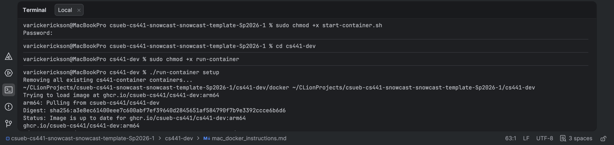
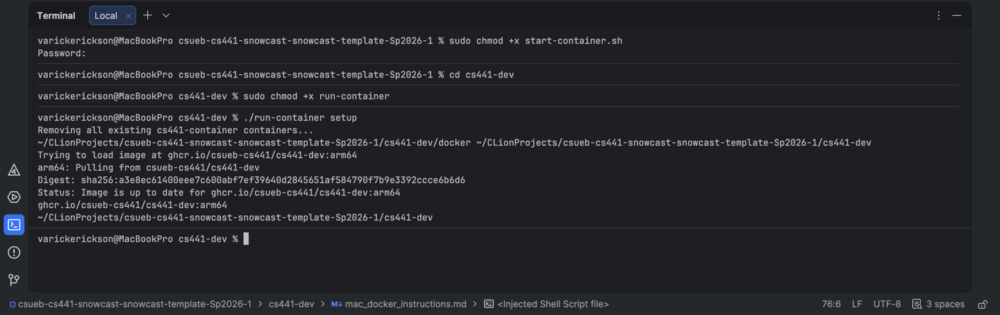
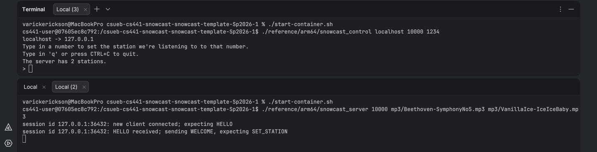
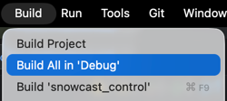
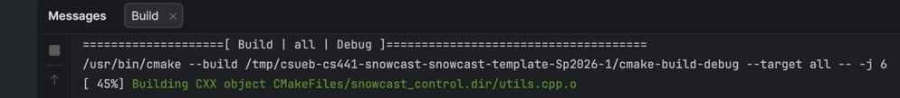
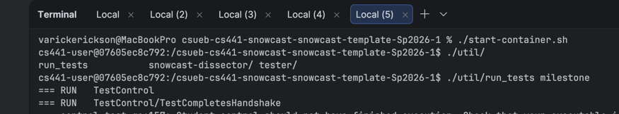

# Docker Instructions for macOS

These instructions will guide you through the installation and setup of docker for macOS users.
Windows and linux users do not need these instructions.

## Why use docker

With docker, you will be able to develop locally. With the container environment, we can specify a standard development environment you can run on your own machine.  This allows students using macOS to run the autograding tools and reference implementations locally.


# Install Docker

[Docker](https://docker.com) is one of the most popular container solutions and widely used in industry.  To install Docker.

1. Download and install Docker Desktop, located [here](https://www.docker.com/products/docker-desktop).

   > ### Already have docker installed?
   > If you already have Docker installed, **we strongly recommend updating to the latest version** by reinstalling it from Docker's website.
   >
   > Many odd quirks and bugs can result from using old versions of Docker, so updating now is the best way to avoid quirks or other issues from coming up later.

   > ### Mac users
   > **We do NOT recommend installing Docker with homebrew.**  This may not install the latest version of all of docker's components, and so is likely to have issues.  Please install the version from Docker's website instead.

2. Open the Docker Desktop application after it has been installed. You may see a message similar to “Your Docker is starting...”. Once this message goes away, your Docker has started successfully!


3. Verify Docker is installed by executing the following in terminal:
    ```shell
    $ docker --version
    ```
   
   Once you execute the above command, you should see the Docker version number, for example:

    ```shell
    $ docker --version
    Docker version 20.10.12, build e91ed57
    ```

4. After installing Docker, a Docker process (the Docker daemon) will run in the background. Run the following command in terminal to verify:
    ```shell
    $ docker info
    ```

   If you see the following error:
    ```
    ERROR: Cannot connect to the Docker daemon at unix:///var/run/docker.sock. Is the docker daemon running?
    ```
   it means Docker hasn’t started running yet. Ensure your Docker Desktop is running.

   > ### Important extra instructions for mac users
   > Some macOS users may experience filesystem issues with default settings:  **[follow these instructions to check your Docker installation](#Filesystem-Performance-on-Macs)**.
   >
   > **Do not skip this step or you may encounter problems later!**

# Prepare the cs441-dev docker image

Next we will be creating the cs441-dev docker image.

For the next part you will need to use the terminal.  For convenience,
you can use the terminal within CLion:



From terminal, you will need to do the following steps:

1. In the main directory, make the `start-container.sh` executable using the following:
   ```shell
   sudo chmod +x start-container.sh
   ```
2. Navigate into the folder `cs441-dev`:
   ```shell
   cd cs441-dev
   ```

3. Change the `run-container` to be executable using the following:
   ```shell
   sudo chmod +x run-container
   ```
4. Run the `run-container` setup command to setup the `cs441-dev` image:
   ```shell
   ./run-container setup
   ```

## Toolchain Configuration

You will next update your toolchain to use the docker container you just set up.



Under Settings->Build,Execution,Deployment->Toolchains, you will add "Docker"
as a toolchain.  Click the `+` to add the "Docker" option:


You should see "Docker" as a new toolchain.  You should see something similar to the following:


Use the up arrow to move the "Docker" toolchain to the top of the list.  This will make it your default toolchain:


## Starting the docker container

Now that we have our docker image `cs441-dev`, we can now use this to run the autograder and reference implementation.

You will use the below procedure to launch the docker container:

```shell
./start-container.sh
```

You are now running a terminal within the docker container.  Anytime you want to run a reference implementation or the 
autograder, you will need start up a docker terminal with the `./start-container` command.

## Example: Running the reference `snowcast_server` and `snowcast_control`

You will likely need to first make the reference implementations executable.
You can make all of the reference implementations executable with the following:

```shell
sudo chmod +x reference/arm64/*
```
> **NOTE:** You will only have to do this the first time.

Here is an example of how you would run the `snowcast_server` and a single `snowcast_control` client:


In one terminal, you would start a docker terminal with `./start-container` and then run:

```shell
./reference/arm64/snowcast_server 10000 mp3/Beethoven-SymphonyNo5.mp3 mp3/VanillaIce-IceIceBaby.mp3 
```

In another terminal you would run:
```shell
./reference/arm64/snowcast_control localhost 10000 1234
```

## Running the Autograder

Again, you will have to mark the autograders as executable. Run the following from inside
the docker container:

```shell
sudo chmod +x util/tester/arm64/*
sudo chmod +x util/run_tests
```
> **Note** This only needs to be done once.

Start by building all of the executables:



You can check to make sure that the toolchain is correct based on the output:



Notice that it is being built in the `/tmp/` folder.  This indicates that the toolchain is configured correctly.

You are now ready to run the autograder:

```shell
./util/run_tests milestone
```



### Filesystem Performance on macOS

**Note**:  This fix relies on the **VirtioFS** file sharing mechanism in Docker/MacOS.  To use it, you might need to update to the latest version of Docker, and possibly update your MacOS version.

There can be sometimes issues where Mac users have very slow filesystem performance inside the container--especially in the home directory, which is shared with your host system.  Docker has several methods of filesystem sharing--we've seen improved performance by switching to the **VirtioFS** method.  To do this:

1. Open the Docker app and enter the settings menu using the gear icon, which looks like this:
   

2. Under the "Choose file sharing implementation" select the **VirtioFS** method:
   

3. Click **Apply & Restart**. (If you have any containers running while changing these settings, you might need to stop them or restart your computer for the changes to take effect.)

5. Close the window and open the settings menu again. Make sure the box is still unchecked.  If it isn't, restart your computer and try again.

If issues persist, please post on the course Discord come to office hours!  (You can continue using the container for now, though.)
