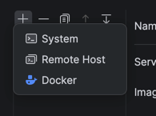
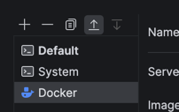
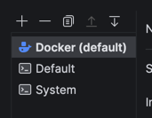

# Docker Instructions for macOS

These instructions will guide you through the installation and setup of docker.

# Install Docker

[Docker](https://docker.com) is one of the most popular container solutions and widely used in industry.  To install Docker.

1. Download and install Docker Desktop, located [here](https://www.docker.com/products/docker-desktop).

   > ### Already have docker installed?
   > If you already have Docker installed, **we strongly recommend updating to the latest version** by reinstalling it from Docker's website.
   >
   > Many odd quirks and bugs can result from using old versions of Docker, so updating now is the best way to avoid quirks or other issues from coming up later.

   > ### Mac users
   > **We do NOT recommend installing Docker with homebrew.**  This may not install the latest version of all of docker's components, and so is likely to have issues.  Please install the version from Docker's website instead.

2. Open the Docker Desktop application after it has been installed. You may see a message similar to “Your Docker is starting...”. Once this message goes away, your Docker has started successfully!


3. Verify Docker is installed by executing the following:
    ```shell
    $ docker --version
    ```

   Once you execute the above command, you should see the Docker version number, for example:

    ```shell
    $ docker --version
    Docker version 20.10.12, build e91ed57
    ```

4. After installing Docker, a Docker process (the Docker daemon) will run in the background. Run the following command to verify:
    ```shell
    $ docker info
    ```

   If you see the following error:
    ```
    ERROR: Cannot connect to the Docker daemon at unix:///var/run/docker.sock. Is the docker daemon running?
    ```
   it means Docker hasn’t started running yet. On Windows or macOS, ensure your Docker Desktop is running. On Linux, try the command `sudo systemctl docker restart` in a terminal.

   > ### Important extra instructions for mac users
   > We have noticed that some MacOS users may experience filesystem issues with default settings:  **[follow these instructions to check your Docker installation](#Filesystem-Performance-on-Macs)**.
   >
   > **Do not skip this step or you may encounter problems later!**

## Preparing the cs441 docker image

For the next part you will need to use the terminal.  For convenience,
you can use the terminal within CLion:


From terminal, you will need to do the following steps:

1. In the main directory, make the `start-container.sh` executable:
   ```bash
   sudo chmod +x start-container.sh
   ```
2. Navigate into the folder
   ```bash
   cd cs441-dev
   ```

3. Change the `run-container` to be executable
   ```bash
   sudo chmod +x run-container
   ```
4. Run the `run-container` setup command
   ```bash
   run-container setup
   ```

## Toolchain Configuration

You will next update your toolchain to use the docker container.

Under Settings->Build,Execution,Deployment->Toolchains, you will add "Docker"
as a toolchain.  Click the plus to add the "Docker" option:



Use the up arrow to make Docker your default toolchain:




